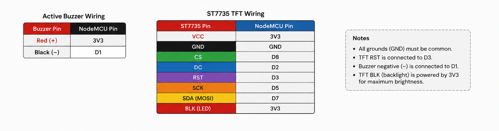

# WiFi DeAuth Detector

## Overview

WiFi DeAuth Detector is an ESP8266-based wireless security monitoring device designed to detect abnormal Wi-Fi deauthentication activity in the surrounding environment.

A deauthentication attack is a type of wireless disruption attack where specially crafted management frames are sent to force devices to disconnect from a Wi-Fi network. This project demonstrates how an ESP8266 can be used as a lightweight security monitoring tool to identify suspicious wireless activity.

The device continuously monitors Wi-Fi traffic, analyzes wireless management frames, and provides real-time alerts when a possible deauthentication event is detected.

This project was developed for educational purposes to understand wireless security concepts, Wi-Fi management frames, and embedded system development.

---

# Features

- Real-time Wi-Fi deauthentication packet detection
- ESP8266 NodeMCU based design
- TFT display monitoring interface
- Buzzer alert system
- Packet counting system
- Configurable detection threshold
- Portable and low-cost hardware implementation
- Arduino IDE compatible

---

# Hardware Components

| Component | Description |
|-----------|-------------|
| ESP8266 NodeMCU | Main processing and Wi-Fi monitoring module |
| ST7735 TFT Display | Real-time status and packet information display |
| Buzzer | Audible security alert |
| Jumper Wires | Hardware connections |
| USB Power Source | Device power supply |

---

# Wiring Diagram

The hardware connections are shown in the following schematic:

## Pin Connections

| Component | ESP8266 Pin |
|-----------|-------------|
| TFT MOSI | D7 |
| TFT SCK | D5 |
| TFT CS | D8 |
| TFT DC | D4 |
| TFT RST | D3 |
| Buzzer Signal | D1 |
| Buzzer VCC | 3.3V |
| Ground | GND |

---

# Working Principle

The ESP8266 operates in monitor mode and observes wireless traffic in the surrounding area.

The device analyzes Wi-Fi management frames and identifies patterns associated with deauthentication activity. When the number of detected deauthentication packets exceeds the configured threshold, the system:

1. Counts suspicious packets.
2. Updates the TFT display.
3. Activates the buzzer alert.
4. Notifies the user about possible Wi-Fi disruption activity.

---

# Software Requirements

## Development Environment

- Arduino IDE

## Required Libraries

- ESP8266WiFi Library
- Adafruit GFX Library
- Adafruit ST7735 Library
- SPI Library

---

# Installation

1. Install Arduino IDE.
2. Install ESP8266 board support package.
3. Install the required libraries.
4. Download this repository.
5. Open:
